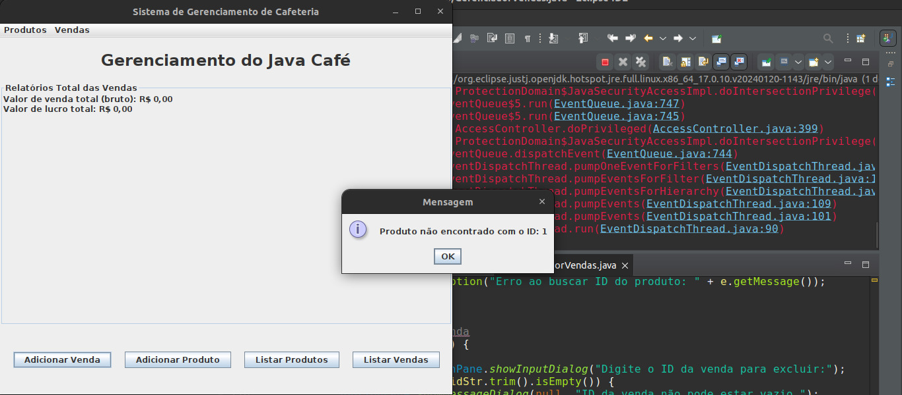
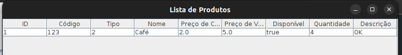

# Review Group:

Name: Ana Lívia de Magalhães Garbin, 14557394

Name: Ana Flor de Oliveira Stefani, 4770143

Name: Nicolas Martins de Oliveira, 14600902

# Group Being Revised:

Name: Vitor Antonio de Almeida Lacerda, 12544761

Name: Bruno Garcia de Oliveira Breda, 11212702

Name: Felipe Oliveira Carvalho, 14613879

 
# 1. Project Quality (4 stars):

## a) Requirements:

Os requisitos listados no relatório estão de acordo com a descrição geral do projeto e cobrem as operações principais necessárias para o sistema.

## b) Project Description:

A descrição do projeto resume suas funcionalidades gerais e as tecnologias utilizadas, detalhando atributos, construtores e métodos. Entretanto, na descrição dos atributos, o grupo avaliador sentiu falta da descrição de tipos de dados, uma vez que no uso da interface foi necessário pesquisar diretamente no código os tipos para insersão nos formulários.
A inclusão do diagrama ajudou muito para o entendimento do fluxo do projeto e suas funcionalidades.
No geral, o relatório descreve todas as principais funcionalidades do sistema, destacando a conexão com o banco de dados.

## c) Comments About Code:

O grupo adicionou aos comentários sobre o código possíveis dúvidas de uso que auxiliam no entendimento do projeto, como decisões de implementação e processos automáticos do projeto.

## d) Plans and Test Results:

A equipe desenvolveu um plano de testes baseado em Casos de Uso, abordando os principais fluxos de uso do negócio - destacando fluxos alternativos. A descrição constrói um plano robusto e bem elaborado de testes manuais, porém não apresenta os resultados obtidos pelo grupo ao executá-los.

## e) Build Procedures:

Os procedimentos de build foram úteis para a execução do projeto, especialmente devido à complexidade adicional de utilizar um banco de dados MySQL. Contudo, na etapa de inclusão do conector JDBC do MySQL ao Eclipse IDE, faltou a especificação do link de download externo do driver, o que dificultou o procedimento. Apesar disso, com o auxílio do relatório, conseguimos adaptar-nos e executar o projeto sem grandes dificuldades.

## g) Problems, General Work Quality, etc:

O grupo avaliado não adicionou suas dificuldades e problemas encontrados no desenvolvimento.
No geral, o relatório abrange os pontos principais para o entendimento do projeto e seus fluxos operacionais, descrevendo bem suas funcionalidades e procedimentos de execução, embora alguns pontos de discussão tenham sido esquecidos.

## f) Group Interactions:

Os grupos interagiram principalmente na discussão sobre prazos e datas de apresentação, além de esclarecer dúvidas sobre decisões de projeto e implementação.
 
# 2. Code Quality (3 stars):

## a) Code Design and frameworks’ use:

O código está separado em dois pacotes, connection e main - dentro do pacote connection está a classe de configuração e conexão com o banco de dados, no pacote main estão as demais classes do projeto.

## b) Code Organization:

O código está bem organizado e sucinto, com uma divisão de classes bem pensada que apresenta boa coesão. Poderia ter sido adotada a estratégia de interfaces para agrupar métodos de uso geral, o que teria melhorado ainda mais a modularidade e reutilização do código.

Embora a separação em pastas pudesse ser mais granular, a nomeação dos arquivos é clara e descritiva, facilitando a compreensão do papel desempenhado por cada classe no projeto. Isso contribuiu significativamente para o entendimento geral do projeto.

## c) How the code works:

O projeto representa um sistema de cafeteria, incluindo operações principais de gestão de vendas e estoque de produtos. O projeto possui uma interface bem organizada, que permite a visualização de produtos e vendas realizadas, além de operações relacionadas ao CRUD (create, read, update e delete).

O grupo avaliador utilizou a IDE Eclipse, conforme sugerido no relatório, e encontrou alguns problemas na execução do sistema: (i) o formulário de adicionar produto não deixa claro o que deve ser inserido no campo 'tipo' e qual seu significado/propósito no cadastro; (ii) o campo 'nome do produto' aceita apenas valores numéricos, o que não é intuitivo.

Além disso, houve problemas na execução do fluxo completo de vendas: (i) apesar de ter produtos cadastrados, não foi possível adicionar vendas relacionadas - a mensagem de erro indicava que o produto não foi encontrado, mas o console mostrava que a tabela 'ItemMenu' não existia (embora estivesse criada e funcional).

Esses problemas prejudicaram a avaliação do fluxo completo do caso de uso sugerido pelo grupo, mas entendemos que ao adicionar um banco de dados externo ao projeto, o sistema ficou sensível a tais erros, dependendo da execução do projeto.

## d) Code Documentation:

O código possui uma documentação clara no decorrer do código, com comentários pontuais e claros sobre cada método - sentimos falta da documentação com Javadoc, porém a documentação fornecida foi suficiente para entendimento do código.
 
# 3. What you would make differently:

Sobre o campo 'Tipo' no cadastro de produtos, embora sua explicação esteja no relatório do grupo, acreditamos que sua presença não faz sentido com as funcionalidades atuais. Caso houvesse mais tempo para o desenvolvimento, adicionaríamos um cadastro de tipos em uma tabela separada, para que a relação entre inteiro e significados fosse mais clara e agregasse valor ao negócio.

Por fim, é importante notar que o projeto cumpre as funcionalidades a que se propõe. Apesar de pequenas falhas ou alterações que poderiam ser implementadas caso houvesse mais tempo disponível, o código tem qualidade e o relatório explica bem o projeto.
